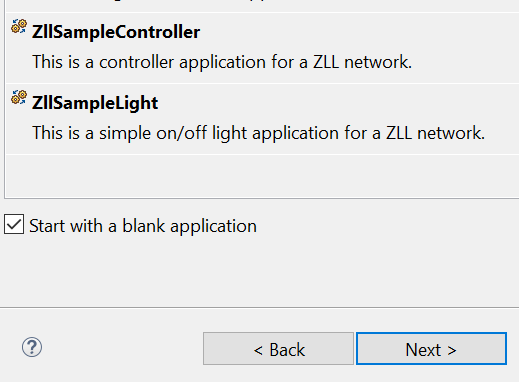
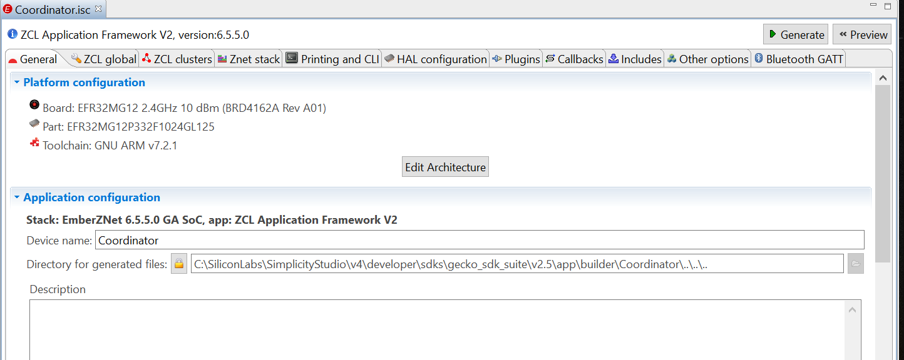
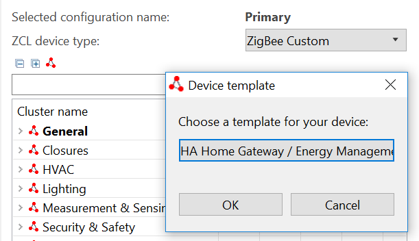
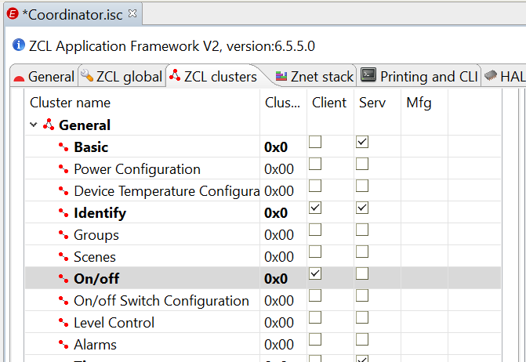
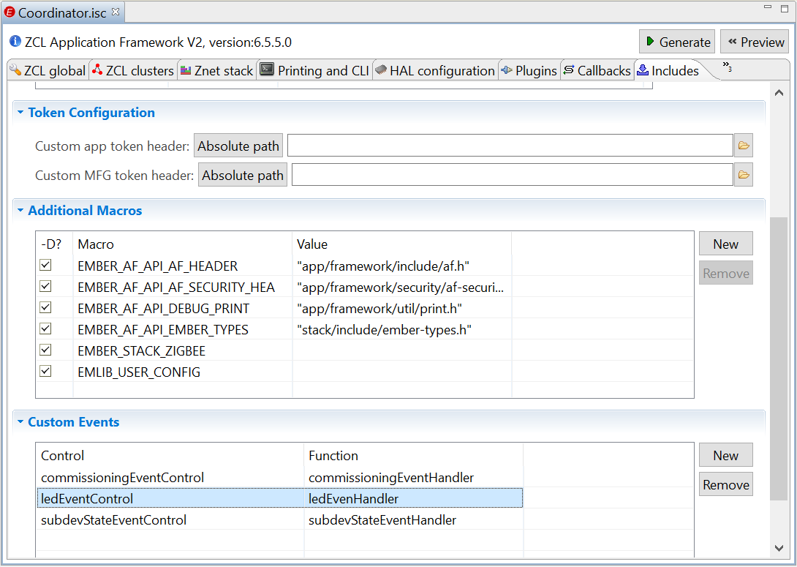
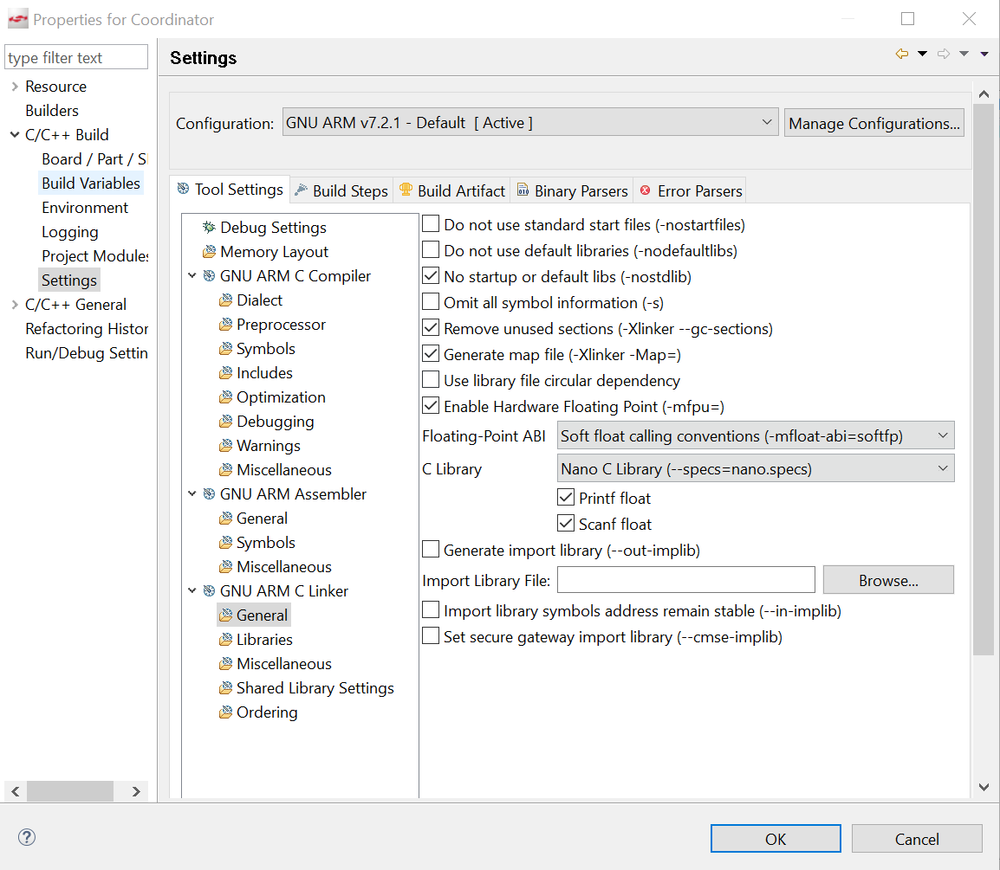

# 天猫精灵控制Zigbee设备

## 1. 介绍
我们在[天猫精灵控制ESP32设备](https://github.com/MarkDing/TmallGenieControlsESP32)的文章中已经知道如何利用阿里巴巴的Link Kit SDK跑在ESP32平台，连接到阿里云的智能生活开放平台，从而使得天猫精灵能够控制WiFi设备的灯的开关。理论上我们可以添加各种协议的方案通过串口和WiFi设备交换信息和命令，从而实现天猫精灵控制终端设备。 例如Zigbee, Bluetooth Mesh, Z-Wave, Proprietary等。天猫精灵本身就支持Bluetooth Mesh设备的直接控制，就没有必要通过这种云对云的方式来控制。那么我们今天要讨论的是如何基于以上技术来实现天猫精灵控制Zigbee的设备。

为了实现控制Zigbee的终端设备，我们需要一个Coordinator来组建Zigbee的Mesh网络，实现终端设备的加网，退网，控制，状态获取等，并通过自定义的协议和WiFi设备通讯，作为一个网络桥接器，和阿里云进行交互，进而实现天猫精灵对Zigbee终端设备的语音控制。

在这个文章中我们选择Silicon Laboratories公司的WSTK板，Radio Board型号是BRD4162A，板上芯片为EFR32MG12来做Zigbee的Coordinator。 
	
## 2. 生成Zigbee的Coordinator
Zigbee协议中Coordinator作为控制中心可以创建Mesh网络，管理子设备入网，退网，命令和信息传输。 
在[官网](https://www.silabs.com/products/development-tools/software/simplicity-studio.)下载并安装好Simplicity Studio (SS)， 然后在SS里面下载好Zigbee SDK. 
	
### 2.1.  生成一个blank project
A) 在SS里点击"New Project"， 选择"ZCL Application Framework V2"，再选"EmberZNet 6.5.5.0 GA SoC 6.5.5.0"，然后勾选"Start with a blank application"，按Next



项目名起为Coordinator，按Next再Finish就生成了一个空的项目工程。
我们会看到项目里只有一个Coordinator.isc的文件，这个是用来配置Zigbee相关的参数，并根据配置自动生成源代码。



如图可以看到许多Tab用来配置不同的参数。

B) 选ZCL global tab，在Manufacturer code输入Ember [0x1002]

C) 选ZCL Clusters， 选择 ZCL device type为"ZigBee Custom->HA Home Gateway / Energy Management"。

	

选General->Basic->On/off, 使能Client



D) 选Plugins tab，使能
* Network Creator
* Network Creator Security
* Device Table
* NVM3 Library
* Simulated EEPROM version2 to NVM3 Upgrade Stub

  禁止Simulated EEPROM version 1 Libray, 这个和NVM3功能重叠了

E) 配置串口

在Plugins tab，选择Serial plugin，使能USART3。
选择HAL configuration tab， 点击"Open Hardware Configurator"打开硬件配置，enable"Virtual COM Port". 选择USART3，关掉Flow control mode, 存盘触发自动生成硬件配置文件，退出Hardware Configurator

F) 选Callbacks tab, 使能如下Callback函数
* Non-cluster related
  * Main Init, Main Tick, Hal Button Isr, Message Sent
* Plugins-specific callbacks
  * Device Left, New Device, State Change -  Device Table plugin specific
  * Complete - Network Creator plugin specific
  
  在下面的章节我们会介绍这些callback函数的用法。

G) 选Includes tab，在Custom Event列表中添加commisioning, led, subdevState event controls



H) 打开项目属性， 将C Library中Print float和Scanf float勾选上，这样处理以后的JSON浮点数就没有问题了


	
I) 在Coordinator.isc右上角点击Generate按钮生成源代码

J) 去除编译错误

由于Device Table是默认在Linux下Gateway工程下工作，有些配置在Soc下编译是不能通过的，需要修改。
* device-table-discovery.c

  添加头文件的包含
```c
#include "app/util/zigbee-framework/zigbee-device-common.h"
```
  去除ezsp的调用，改为ember的调用函数。

```c
static void setCurrentSourceRoute(uint16_t nodeId)
{
  emberAppendSourceRouteHandler(nodeId, EMBER_NULL_MESSAGE_BUFFER);
}
```

* device-table.c

  添加include的路径， 以及NVM3的头文件和KEY的定义
```c
#include "app/framework/util/af-main.h"
#include "app/framework/util/attribute-storage.h"
#include "app/framework/util/common.h"

#if defined (USE_NVM3)
#include "nvm3.h"
#include "nvm3_hal_flash.h"
// Device table counter key and data key
#define NVM3_DT_CNT_KEY 0x1000
#define NVM3_DT_KEY     0x2000
#endif
```

Device Table的存取默认是在Linux下用文件形式操作，但是在Soc上我们要把接口替换为NVM3的方式来操作

```c
void emAfDeviceTableSave(void)
{
  EmberAfPluginDeviceTableEntry *deviceTable = emberAfDeviceTablePointer();
  uint8_t i;
  uint32_t counter = 0;

  for (i = 0; i < EMBER_AF_PLUGIN_DEVICE_TABLE_DEVICE_TABLE_SIZE; i++) {
    if (deviceTable[i].nodeId != EMBER_AF_PLUGIN_DEVICE_TABLE_NULL_NODE_ID) {
      nvm3_writeData(nvm3_defaultHandle,NVM3_DT_KEY + counter, &deviceTable[i], sizeof(deviceTable[i]));
      counter++;
    }
  }
  // Write counter
  nvm3_writeCounter(nvm3_defaultHandle, NVM3_DT_CNT_KEY, counter);
}

void emAfDeviceTableLoad(void)
{
  EmberAfPluginDeviceTableEntry *deviceTable = emberAfDeviceTablePointer();
  uint8_t i;
  uint32_t counter = 0;
  // Read number of object of device table
  nvm3_readCounter(nvm3_defaultHandle, NVM3_DT_CNT_KEY, &counter);
  for (i = 0; i < counter; i++) {
    nvm3_readData(nvm3_defaultHandle,NVM3_DT_KEY + i, &deviceTable[i], sizeof(deviceTable[i]));
    deviceTable[i].state = EMBER_AF_PLUGIN_DEVICE_TABLE_STATE_JOINED;
    deviceTable[i].lastMsgTimestamp = halCommonGetInt32uMillisecondTick();
  }
}
```

处理完毕编译通过。
	
### 2.2 增添文件和功能函数
A) device-table-tracking.c 

getCurrentState()函数需要被外部调用，去除其static的定义。另外添加一个getLastDeviceId()函数同样为外部调用。

B) cJSON.c, 用来处理JSON格式的信息

将本Repo的network\utility\cjson\下的cJSON.c和cJSON.h拷贝到和Coordinator_callbacks.c的同目录下。
把其中的动态内存分配的宏改为标准函数名字
```c
#define internal_malloc malloc
#define internal_free free
#define internal_realloc realloc      
```
由于Zigbee的SDK没有考虑动态内存分配的事情，需要我们在Coordinator_callbacks.c定义一个64KB的数组，section为".heap"，这样动态内存分配函数就可以在heap区工作。

C) hal-config\hal-config.h, 将此头文件里的HAL_SERIAL_USART3_ENABLE 设置为1，否则USART3不能工作，每次isc重新生成文件后，此文件都会被覆盖，需要人工把它改过来。

D) Coordinator_callbacks.c

在这个文件里集中了我们生成的所有callback函数，我们把协议处理和WiFi处理器通讯部分都在此函数实现. 详情可以看本Repo的coordinator\coordinator_callbacks.c. 下面我们简要的介绍些流程和功能函数。

* emberAfMainInitCallback()

  此函数初始化时被调用，我们在这里初始化串口，LED，并启动一个延时子设备状态查询的Event，每30秒查询一次。
```c
void emberAfMainInitCallback(void)
{
  halInternalInitLed();
  emberSerialInit(APP_COM, 115200, PARITY_NONE, 1);
  emberEventControlSetDelayMS(subdevStateEventControl, SUBDEV_STATE_PERIOD_MS);
}
```
* emberAfHalButtonIsrCallback()

  在有按键的情况下激活commissioningEventControl

* commissioningEventHandler()

  建立一个centralized network。 在网络建好后，button0触发开放网络允许子设备加入， button1关闭网络禁止设备加入。

* subdevStateEventHandler()

  从device table里依次找出子设备的device index, 发送Identify命令给子设备。子设备由于断电和加电会使得命令发送失败或者成功，我们就可以知道子设备在线与否。 

* emberAfMessageSentCallback()

  每条对子设备发送的命令都会回调此函数，通过判断通讯成功和失败，来改变子设备的登记状态。

* emberAfPluginDeviceTableNewDeviceCallback()

  当有子设备加网成功，此函数会被调用，我们会在这里通知WiFi控制器新设备加入的信息，进而更新阿里云服务器上的设备拓扑关系。

* emberAfPluginDeviceTableDeviceLeftCallback()

  子设备退网触发此函数，同样通知阿里云改变设备拓扑关系。

* emberAfPluginDeviceTableStateChangeCallback()

  当子设备的device table的状态发生变化， 如在线，离线，未知等，发送response packet到WiFi控制器，进而改变设备在阿里云服务器上的在线和离线状态。

* cmdHandler() and sendResponsePacket()

  用来处理和WiFi控制器之间的通讯。

* emberAfMainTickCallback()

  在每个系统tick结尾处调用，用来查看串口是否有命令数据进来。超过4个字节就调用cmdHandler()来处理命令。

